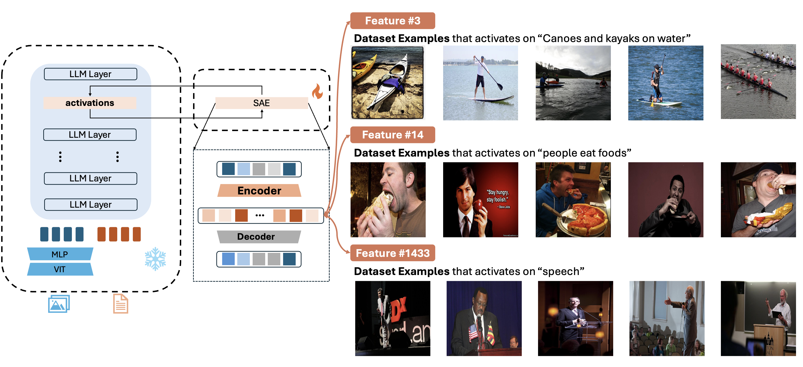
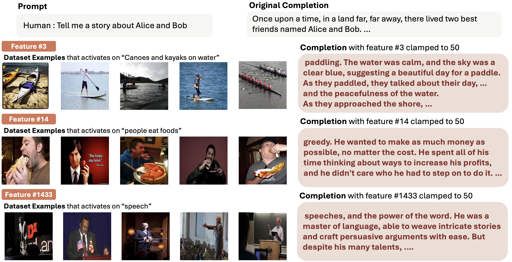
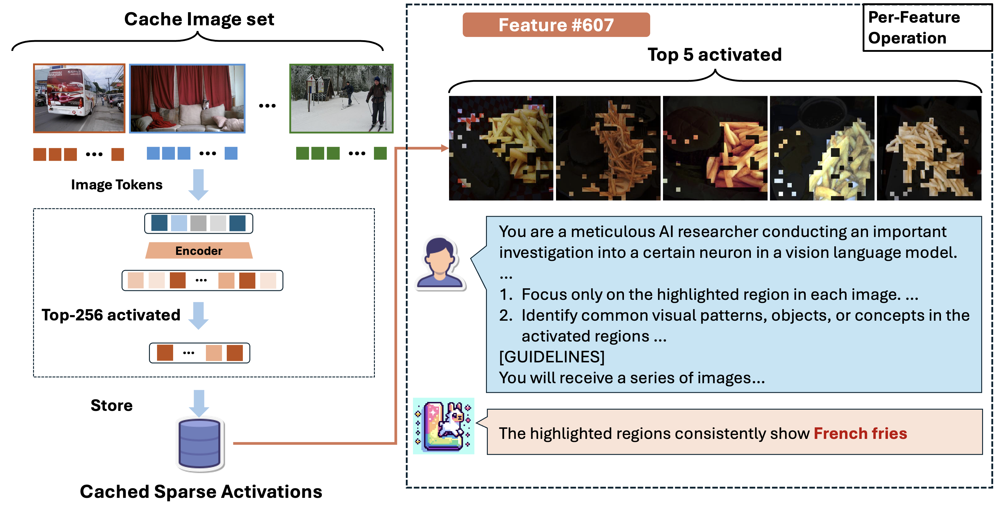
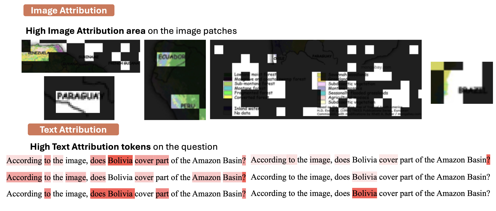

# Large Multi-modal Models Can Interpret Features in Large Multi-modal Models

🔍 [ArXiv Paper](https://arxiv.org/abs/2411.14982) | 🏠 [LMMs-Lab Homepage](https://lmms-lab.framer.ai) | 🤗 [Huggingface Collections](https://huggingface.co/collections/lmms-lab/llava-sae-674026e4e7bc8c29c70bc3a3)

For the first time in the multimodal domain, we demonstrate that features learned by Sparse Autoencoders (SAEs) in a smaller Large Multimodal Model (LMM) can be effectively interpreted by a larger LMM. Our work introduces the use of SAEs to analyze the open-semantic features of LMMs, providing the solution for feature interpretation across various model scales.

This research is inspired by Anthropic's remarkable [work](https://transformer-circuits.pub/2024/scaling-monosemanticity/) on applying SAEs to interpret features in large-scale language models. In multimdoal models, we discovered intriguing features that correlate with diverse semantics and can be leveraged to steer model behavior, enabling more precise control and understanding of LMM functionality.



The Sparse Autoencoder (SAE) is trained on LLaVA-NeXT data by integrating it into a specific layer of the model, with all other components frozen. The features learned by the SAE are subsequently interpreted through the proposed auto-explanation pipeline, which analyzes the visual features based on their activation regions.




These features can then be used to steer model's behavior to output desire output. You can check our papers for more details.


## Install

This codebase is built upon the [`sae-auto-interp`](https://github.com/EleutherAI/sae-auto-interp) repo and we modified it so that it can be used for LMMs and support other functionalities. The installation can be easily done by the following steps:
```bash
conda create -n sae-auto-interp python=3.9
conda activate sae-auto-interp
python3 -m pip install -e . # python3 -m pip install . for permanent install
```

## Cache and Explain


The visual auto interpretation pipeline is shown above. To be able to run the above pipeline, you will need to first cache the activations. The caching can be done using following scripts:

```bash

LLaVA_VERSION="llava-hf/llama3-llava-next-8b-hf"
DATASET_VERSION="lmms-lab/sae-sample-cache-dataset"
SAE_PATH="lmms-lab/llama3-llava-next-8b-hf-sae-131k"

# ctx_len has no meaning when caching images, I just keep the same format as caching text
torchrun --nproc_per_node=<your_gpu_num> --master_addr=<your_master_addr> --master_port=<your_master_port> \
    -m sae_auto_interp.launch.cache.cache_image \
    $LLaVA_VERSION \
    $DATASET_VERSION \
    --split "train" \
    --save_dir ./sae_cache/llava_llama_3_sae_la_1p6_131k_first5k \
    --n_splits 128 \
    --sae_path $SAE_PATH \
    --ctx_len 64 \
    --batch_size 1 \
    --filters_path filters_5k.json
```

Since it is not realistic to interpret every feature, you are recommended to create a filter and only interpret a small amount of the features. A filter is a dictionary with its key correspond to a model layer name and value correspond to the index of the feature. For example, the following is a filter for the first 3 features in the sae and only activations for these three features will be stored.

We provide a sample cache dataset for you to do the explanations. You can use any other image dataset that has the image columns. We also open-sourced our produced explanations and you can find them in our collections.

```json
{
  "model.layers.24": [0,1,2]
}
```

Then you can run the auto explanation by using

```bash
python3 -m sae_auto_interp.launch.explain.explain_images \
    --model $LLaVA_VERSION \
    --dataset $DATASET_VERSION \
    --example_ctx_len 64 \
    --n_splits 128 \
    --sae_path $SAE_PATH \
    --split "train" \
    --save_dir ./sae_cache/llava_llama_3_sae_la_1p6_131k_first5k \
    --width 131072 \
    --explanation_dir  ./explanation_dir/llava_llama_3_sae_la_1p6_131k \
    --filters_path filters_5k.json \
    --max_examples 5
```

By default the activated region is being interpolate using bilinear mode but you can also change it to other mode inside the code. We use `LLaVA-OV-72B` as the explanation model.


## Steering

We provide a simple tool for steering the model's behavior. You can run the `tools/model_steering.py` using the following script:

```bash
python3 tools/model_steering.py \
    -t <Input Text> \
    --sae-path $SAE_PATH \
    -k 50 -f <feature_idx>
    # You can add following args also
    # -i <image_path> for image input
    # --pure-text for apply chat template or not
```

or else, you can also perform large scale feature steering through

```bash
torchrun --nproc_per_node=<your_gpu_num> --master_addr=<your_master_addr> --master_port=<your_master_port> \
    -m sae_auto_interp.launch.features.steering \
    -t "Tell me a story about Alice and Bob" \
    --sae-path $SAE_PATH \
    --filters filters_5k.json
```

## Attribution Caching



In our paper, we also demonstrate a method that can be used to locate high feature contribution for a certain output token compare to another baseline token. Our method mainly adopted the pipeline of [`attribution patching`](https://www.neelnanda.io/mechanistic-interpretability/attribution-patching). This method can be used to find the features with high contribution towards a certain input and help you filter out the features. However, different from the text, we found out that their are many low level vision features that have high contribution. Thus, you might need to set the top-k value to a high value for example 100 to actually get the features you want.

To perform attribution caching, you should first prepare a json file for the data like this:
```json
[
    {
        "prompt" : "<Your Prompt",
        "answer" : "<The answer token>",
        "baseline" : "<The baseline token>",
        "image" : "<image_path>"
    }
]
```

Then, you would be able to perform attribution patching using this script:

```bash
torchrun --nproc_per_node=<your_gpu_num> --master_addr=<your_master_addr> --master_port=<your_master_port> \
    -m sae_auto_interp.launch.features.attribution_patching \
    "llava-hf/llama3-llava-next-8b-hf \
    --data_path <path_to_your_prepared_json> \
    --sae_path $SAE_PATH \
    --selected_sae model.layers.24
```

We prepare another tool `create_filters_from_attribution.py` to allow you to create filters from the cache. Since the attribution patching requires one backward operation, you are recommend to use a small resolution image or load the model in quantized mode.

## Evaluation
We evaluate our interpretation using IOU and CLIP-Score. For IOU, you can run the following scripts:

```bash
python3 \
    -m sae_auto_interp.launch.score.segment \
    --explanation_dir <your_explanation_dir \
    --filters filters_5k.json \
    --save-refine-path <path_to_save_refine_explanation> \
    --save-score-path <path_to_save_scores> \
    --selected-layer model.layers.24 \
    --dataset-path lmms-lab/sae-sample-cache-dataset \
    --dataset-split train \
    --activation_dir <path_to_activations_cache> \
    --width 131072 --n-splits 128
    # --refine-cache <path_to_stored_refine_explanation>
```

We use LLaMA-3.1-Instruct-8B to refine the explanation before sending into Grounding-Dino + SAE. The total process should be quick using sglang and if you store these refined explanation, you can directly use it for the evaluation. For CLIP-Score, you can use the following script:

```bash
python3 \
    -m sae_auto_interp.launch.score.clip_score \
    -d lmms-lab/sae-sample-cache-dataset \
    --explanation_dir <your_explanation_dir \
    --save-refine-path <path_to_save_refine_explanation> \
    --save-score-path <path_to_save_scores>
    # --refine-cache <path_to_stored_refine_explanation>
```

## Train

The training code has been release, you can find it in the `train` folder. Please follow the documentation in the train folder for the training pipeline.

## Limitation
This codebase is mainly built to interpret the visual features for the model `LLaVA-NeXT-LLaMA-8B` so there might be some hardcoded logic to handle some edge cases across the pipeline. If you intend to use the code on other models, this might need to be noticed.

The auto explanation process is not perfect and in fact there are many wrong cases due to the model's ability. We definitely believe that in the future their would be more open-sourced vision models that have better reasoning skills and can be applied to this pipeline.

## Acknowledgement
This codebase is a detached fork built upon the [`sae-auto-interp`](https://github.com/EleutherAI/sae-auto-interp) repo and modified for the use of our purpose. We modify and delete a lot of parts of the original code so the code structure might be quite different and has different functionalities. We also recommend you to read through their documentations and their [blog](https://blog.eleuther.ai/autointerp/) for their wonderful works

## Citations
If you find this work helpful, please cite
```shell
@misc{zhang2024largemultimodalmodelsinterpret,
      title={Large Multi-modal Models Can Interpret Features in Large Multi-modal Models},
      author={Kaichen Zhang and Yifei Shen and Bo Li and Ziwei Liu},
      year={2024},
      eprint={2411.14982},
      archivePrefix={arXiv},
      primaryClass={cs.CV},
      url={https://arxiv.org/abs/2411.14982},
}
```
